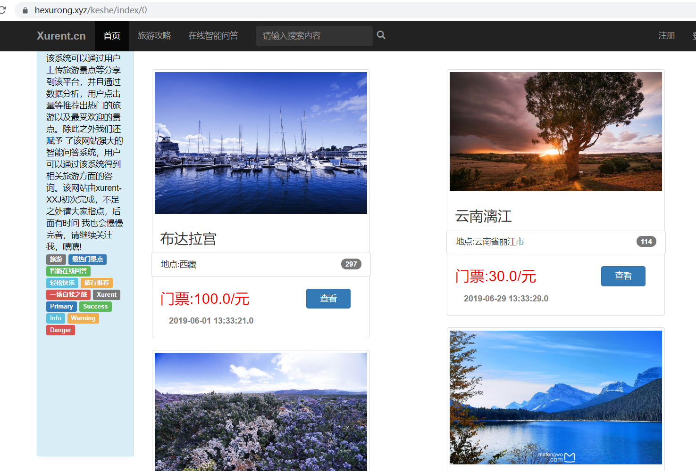
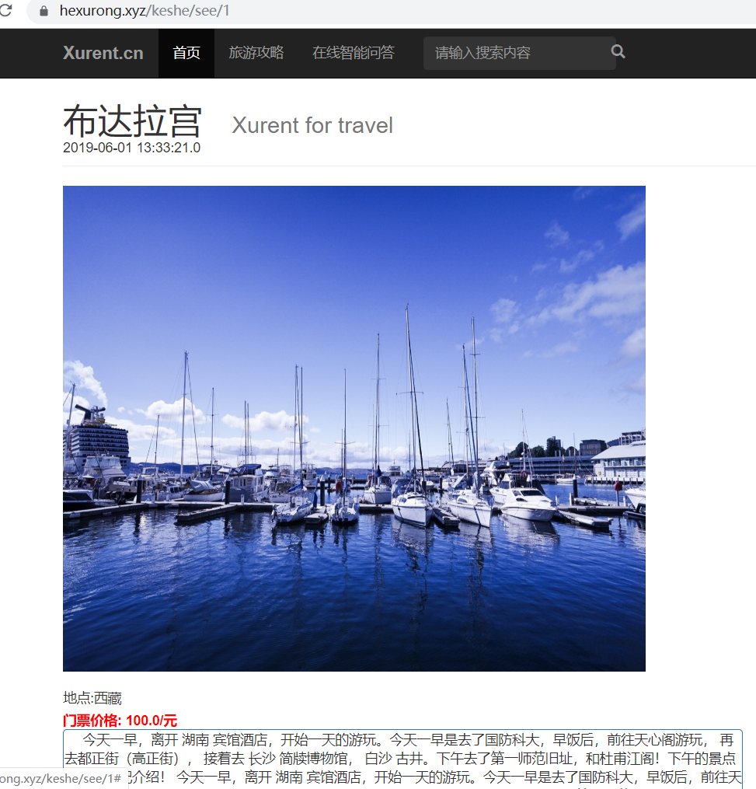
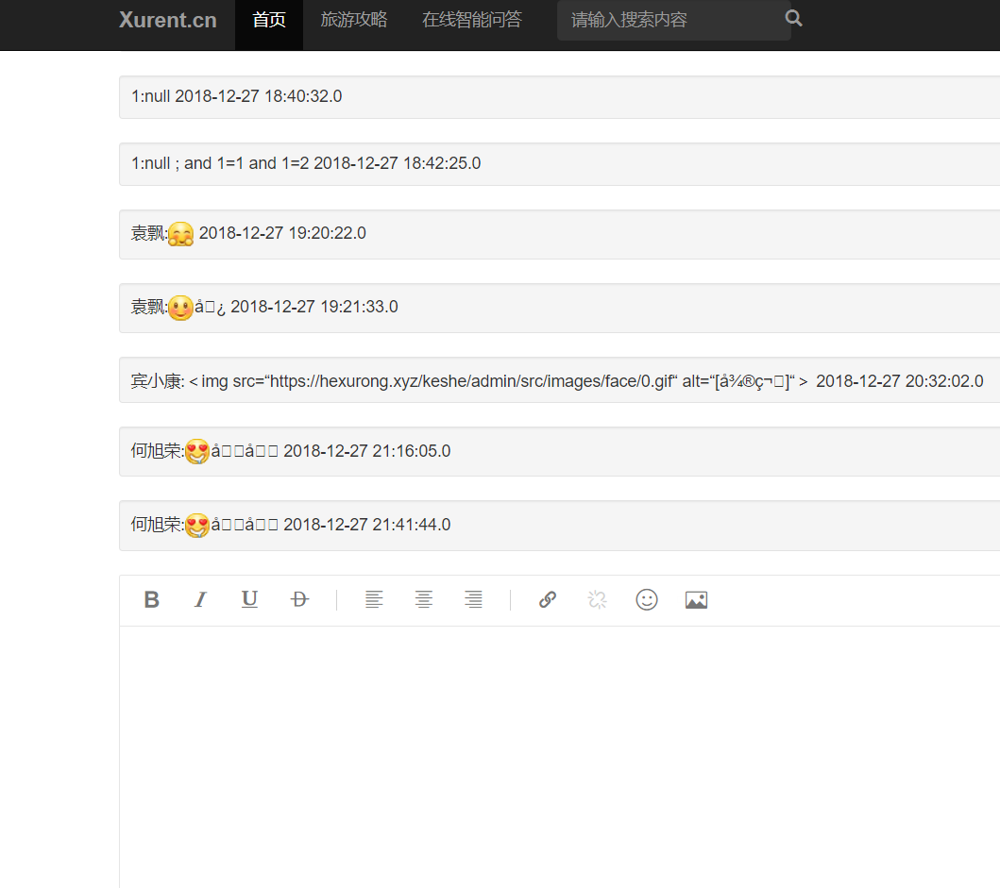
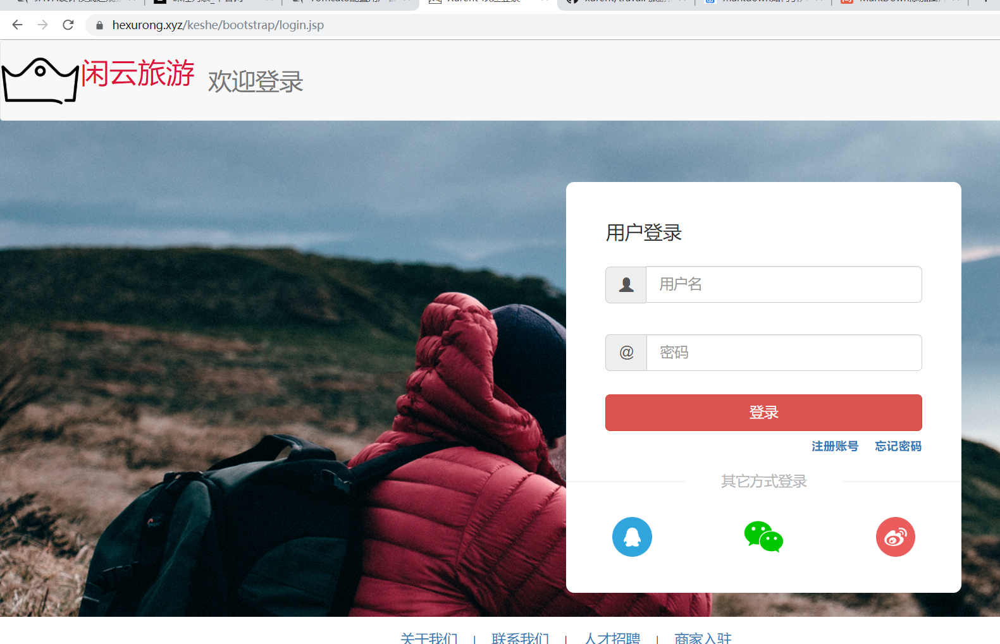
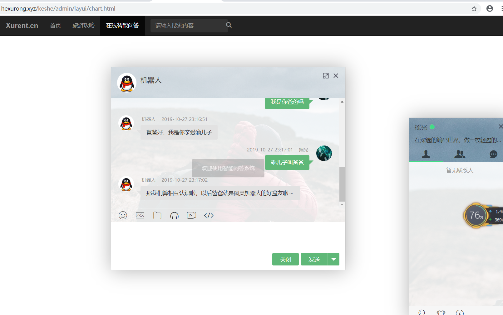
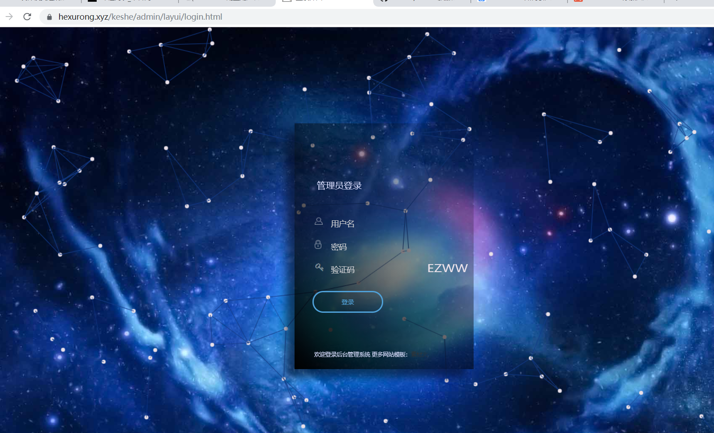
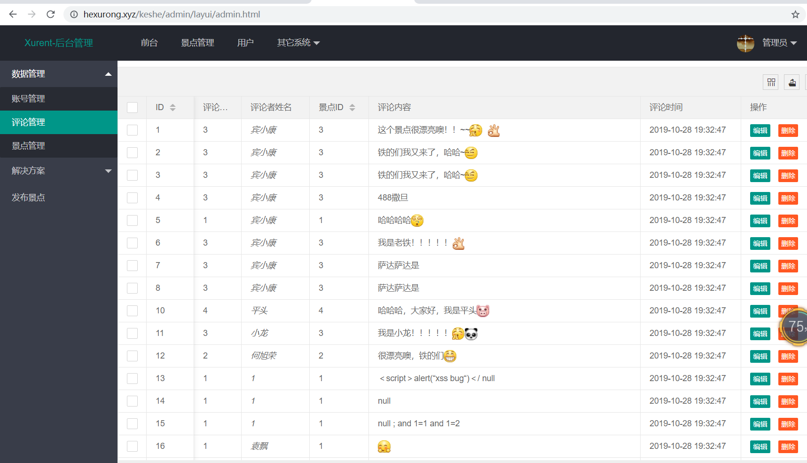

# 旅游推荐与智能问答

+ 本系统前台页面用的是jsp和bootstrap框架，后台页面用的是html5和layui框架，后端采用的是ssh架构开发的

> 具体介绍不想写了，给几张图片浏览吧，如果想体验，网址是https://hexurong.xyz/keshe/index/0  
>后台登录地址是https://hexurong.xyz/keshe/admin/layui/login.html

## 前台预览

 + 这是首页比较简介

### 详情页面

### 登录页面

### 智能问答页面

### 后台管理页面与后台登录页面

>  后台管理登录网址是https://hexurong.xyz/keshe/admin/layui/login.html，
>  账号密码为：123456

